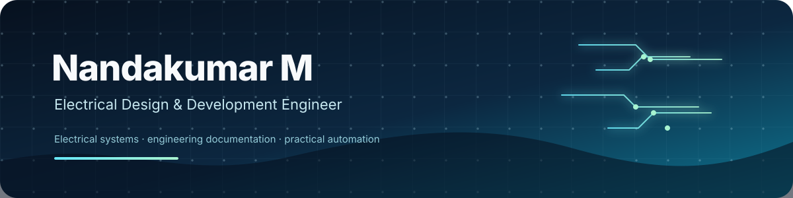

[Portfolio](https://nandakumarm.dpdns.org) · [GitHub](https://github.com/nandurpm) · [Email](mailto:nandakumarkdpm@gmail.com)

## About me

I am an **Electrical Design & Development Engineer** working with escalator electrical systems, engineering documentation, schematics, wiring diagrams, control circuits, BOMs, and engineering revisions. My work focuses on accurate design, maintainable documentation, production support, and clear technical communication.

Alongside my engineering work, I build educational platforms and practical automation tools that make technical learning and repetitive workflows easier.

## What I work on

| Area | Practical focus |
| --- | --- |
| Electrical design | Escalator electrical systems, control circuits, panels, wiring, and schematics |
| Engineering documentation | Drawings, BOMs, revisions, document control, and production support |
| Software and automation | HTML, CSS, JavaScript, GitHub Actions, Linux, and AI-assisted workflows |
| Technical learning | Structured diploma lessons, quizzes, study resources, and engineering utilities |

## Featured projects

### [POLY PMNA — Diploma learning platform](https://github.com/nandurpm/diploma-notes)

A student-focused learning platform for Kerala Diploma learners. It organizes syllabus information, lessons, revision material, quizzes, study resources, and engineering support tools in one place.

**Focus:** structured learning · revision resources · mobile-friendly web experience · educational tooling

### [Personal engineering portfolio](https://github.com/nandurpm/portfolio)

A static portfolio website for presenting engineering experience, projects, articles, downloadable material, and professional contact information. It includes an automated workflow for publishing blog posts and project pages.

**Focus:** static web development · content publishing · responsive UI · documentation

### Ask Poly AI

An educational assistant concept for helping diploma students find syllabus-aware explanations, lesson guidance, engineering formulas, and revision support. The project is presented through the POLY PMNA ecosystem.

**Focus:** educational AI · knowledge organization · engineering explanations

### BOM validation and engineering utilities

A collection of practical tools and workflows for reducing repetitive engineering checks, improving documentation quality, and making technical information easier to review.

**Focus:** validation · reporting · document quality · workflow automation

## Engineering experience

### Johnson Lifts & Escalators — Electrical Design & Development Engineer

**July 2025 – Present**

I prepare and maintain electrical schematics, wiring diagrams, control-circuit documentation, BOMs, and engineering revisions for escalator systems. I also support production, testing, troubleshooting, cross-functional coordination, and documentation improvement.

### Previous experience

My earlier experience includes quality and assembly operations in automotive manufacturing, CNC machine operation and dimensional inspection, and video editing. These roles strengthened my attention to detail, process discipline, visual communication, and practical problem solving.

## Selected capabilities

- Electrical schematic and wiring-diagram preparation
- Escalator electrical systems and control circuits
- BOM preparation, checking, and document control
- Engineering change and revision management
- Production support, testing, troubleshooting, and root-cause analysis
- HTML, CSS, JavaScript, Git, GitHub Actions, and Linux
- Technical writing, learning-platform development, and workflow automation

## Current focus

1. Improving electrical documentation quality and revision workflows.
2. Expanding POLY PMNA learning resources and revision content.
3. Building practical engineering utilities and AI-assisted learning tools.
4. Learning more about PLC programming, industrial automation, SCADA, control systems, and web performance.

## Selected metrics

These figures are approximate personal-work indicators and should be updated as the work grows.

| Indicator | Approximate scale |
| --- | ---: |
| Electrical schematics and drawings handled | 500+ |
| Technical documents maintained or developed | 1,000+ |
| Engineering revisions supported | 300+ |
| Escalator projects supported | 20+ |
| Diploma lessons and learning resources developed | 100+ |

## Education

| Qualification | Institution | Year or result |
| --- | --- | --- |
| Diploma in Electronics Engineering | Government Polytechnic College, Perinthalmanna | Completed |
| Higher Secondary | Government HSS Kadungapuram | 2016 · 79% |
| SSLC | Government HSS Kadungapuram | 2014 · 95% |

## Engineering principles

> **Every electrical schematic represents a real system. Precision in design today helps prevent failures tomorrow.**

I value accuracy, maintainability, traceable decisions, clear documentation, continuous learning, and solutions that work reliably in practical environments.

## Contact

- **Portfolio:** [nandakumarm.dpdns.org](https://nandakumarm.dpdns.org)
- **GitHub:** [github.com/nandurpm](https://github.com/nandurpm)
- **Email:** [nandakumarkdpm@gmail.com](mailto:nandakumarkdpm@gmail.com)

---

## Repository maintenance

This is the special `nandurpm/nandurpm` profile repository: GitHub renders this root `README.md` on the `nandurpm` account page. It contains profile content and presentation assets only; implementation code is maintained in separate repositories.

### Structure

| Path | Responsibility |
| --- | --- |
| `README.md` | Public profile content rendered by GitHub |
| `assets/` | Versioned visual assets referenced by the profile README |
| `.gitignore` | Local secret, editor, operating-system, and temporary-file exclusions |

### Related implementation repositories

- [Portfolio website](https://github.com/nandurpm/portfolio)
- [POLY PMNA / Diploma Notes](https://github.com/nandurpm/diploma-notes)
- [POLY PMNA PDF archive](https://github.com/nandurpm/poly-pmna-pdf-files)

### Update rules

- Keep project descriptions and links aligned with their implementation repositories.
- Update time-sensitive employment, education, focus, and metric statements when their source facts change.
- Preview the README on GitHub after changing HTML alignment, tables, links, or the hero asset.
- Do not commit credentials, private work information, access tokens, customer data, or generated secrets.
